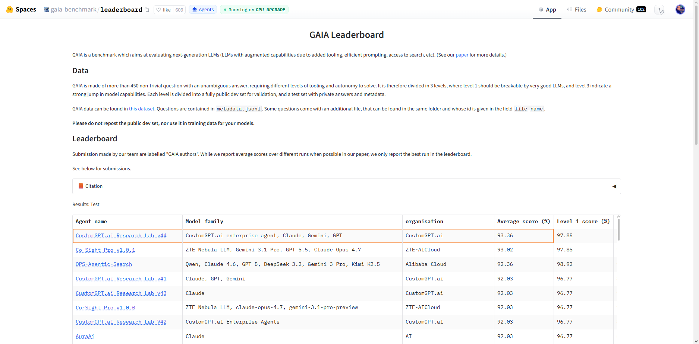

<p align="center">
  
</p>

<h1 align="center">CustomGPT Agent</h1>

<p align="center">
  <strong>An enterprise-grade AI agent powered by Claude, GPT, Gemini and CustomGPT.ai</strong>
</p>

<p align="center">
  <a href="https://customgpt.ai"></a>
  <a href="https://docs.anthropic.com/en/docs/agents-and-tools/claude-code/overview"></a>
  <a href="https://e2b.dev"></a>
  <a href="https://playwright.dev"></a>
  <a href="https://huggingface.co/spaces/gaia-benchmark/leaderboard"></a>
</p>

<p align="center">
  
  
  
  
</p>

<p align="center">
  
  
</p>

---

## 🏆 Results — #1 on the GAIA Leaderboard

**CustomGPT.ai Research Lab is #1 on the [GAIA benchmark](https://huggingface.co/spaces/gaia-benchmark/leaderboard)** — the top-ranked general AI assistant agent in the world, ahead of every major lab.

| Rank | Agent | Organisation | Average score |
|:---:|---|---|:---:|
| 🥇 **1** | **CustomGPT.ai Research Lab v44** | **CustomGPT.ai** | **93.36%** |
| 2 | Co-Sight Pro v1.0.1 | ZTE-AICloud | 93.02% |
| 3 | OPS-Agentic-Search | Alibaba Cloud | 92.36% |
| 4 | Lemon | LR AILab, Lenovo CTO Org | 91.36% |
| 5 | Nemotron-ToolOrchestra-0106 | NVIDIA | 90.37% |
| 6 | SU Zero – Shuqian Series Pro MAX | Suzhou AI Lab / Shuqian Tech | 90.03% |
| 7 | HALO V1217-1 | Microsoft AI Asia – Ads | 89.37% |

<sub>Leading entries on the [GAIA Leaderboard](https://huggingface.co/spaces/gaia-benchmark/leaderboard) as of 5 June 2026. CustomGPT.ai holds the #1 position.</sub>

<p align="center">
  
</p>

---

## Overview

**CustomGPT Agent** is a multi-agent AI system that combines [CustomGPT.ai](https://customgpt.ai)'s enterprise RAG platform with frontier-model reasoning and secure sandboxed code execution. It is designed to solve complex, real-world tasks that require multi-step reasoning, web research, file analysis, visual browser navigation, and computation.

The agent ranks **#1 on the [GAIA Benchmark](https://huggingface.co/spaces/gaia-benchmark/leaderboard)** (General AI Assistants) — a challenging benchmark that tests AI systems on tasks requiring real-world tool use, multi-step reasoning, and web browsing — tasks that go far beyond simple question answering.

The orchestrator is **provider-agnostic**: it runs on Claude Opus 4.6/4.7 via the Claude Agent SDK or on OpenAI GPT-5.5 through a parallel orchestrator, with a configurable thinking level per run. For tasks that require *seeing* a page — Google Street View, 3D model viewers, interactive maps — the agent drives a **real headed Chromium browser** through a vision-first computer-use tool suite, with Google Gemini 3.1 Pro as a secondary vision provider. Every step is wrapped by a **quality & verification plane** that re-checks claims against primary sources before any answer is returned.

---

## Architecture

The system is organized into four planes: a **provider-agnostic orchestrator**, a set of **specialist subagents**, a **shared MCP tool layer**, and a **quality & verification plane** that wraps every step.

```
┌─────────────────────────────────────────────────────────────────────────┐
│              ORCHESTRATOR  (provider-agnostic, ReAct loop)               │
│     Claude Opus 4.6 / 4.7 (Agent SDK)   •   OpenAI GPT-5.5               │
│     Configurable thinking level  •  Plan → Act → Verify                  │
│     Experience memory + runtime-error memory injected into the prompt    │
└──┬────────┬────────┬────────┬────────┬────────┬─────────────────────────┘
   │        │        │        │        │        │   delegates via Task tool
┌──▼───┐ ┌──▼───┐ ┌──▼────┐ ┌─▼─────┐ ┌▼──────┐ ┌▼───────┐
│PLAN- │ │LOOKUP│ │COMPUTA│ │ FILE  │ │VISUAL │ │ CRITIC │
│NER   │ │(Opus)│ │-TION  │ │ANALY- │ │ANALYST│ │ (Opus) │
│      │ │web/  │ │(Sonnet│ │SIS    │ │(headed│ │grounded│
│plan  │ │wiki  │ │double-│ │(Sonnet│ │browser│ │re-check│
│      │ │rsrch │ │compute│ │ vision│ │ cu_*) │ │vs src  │
└──┬───┘ └──┬───┘ └──┬────┘ └──┬────┘ └──┬────┘ └─┬──────┘
   │        │        │         │         │        │
┌──▼────────▼────────▼─────────▼─────────▼────────▼───────────────────────┐
│                       MCP TOOL LAYER  (~30 tools)                        │
│  Search/Browse:  web_search · search_wiki · search_google · query_arxiv │
│                  · ask_perplexity · jina_search · jina_read ·           │
│                  browse_webpage · search_archive · find_paper ·         │
│                  fetch_via_wayback                                       │
│  Media/Video:    youtube_metadata · youtube_captions · youtube_search · │
│                  identify_song · extract_video_frames · extract_audio   │
│  Execution:      execute_python · execute_shell · read_file · write_file│
│                  (E2B microVM, Playwright)                              │
│  Vision/CU:      describe_image · image_question · cu_screenshot ·       │
│                  cu_click · cu_type · cu_scroll · cu_zoom · cu_navigate  │
│  Knowledge:      search_knowledge_base  (CustomGPT.ai RAG)              │
│  Reasoning/Mem:  deep_think · fetch_experiences · submit_answer          │
└──┬──────────────────────────────────────────────────────────────────────┘
   │
┌──▼──────────────────────────────────────────────────────────────────────┐
│              QUALITY & VERIFICATION PLANE  (hooks + loops)               │
│  • Quadruple-Verification hooks — 4 cycles on every tool output          │
│      C1 code quality · C2 security · C3 stop-quality · C4 research       │
│  • Self-Correction loop — render → screenshot → analyze → fix (×3)       │
│  • Majority-vote self-consistency across N runs                          │
│  • Budget / loop-detection / audit-log / safety hooks                    │
└──────────────────────────────────────────────────────────────────────────┘
```

### Components

| Component | Technology | Role |
|-----------|-----------|------|
| **Orchestrator** | Claude Opus 4.6 / 4.7 (Agent SDK) **or** OpenAI GPT-5.5 | Task decomposition, routing, evidence-backed reasoning, and final answer synthesis — model & thinking level selectable per run; prompt augmented with experience + runtime-error memory |
| **PLANNER Subagent** | Claude / GPT-5.5 | Produces a structured plan (question restatement, strategy, micro-step queue) before execution begins |
| **LOOKUP Specialist** | Claude Opus + search/browse tools | Web/wiki/arXiv/Perplexity research and fact retrieval, page navigation |
| **COMPUTATION Specialist** | Claude Sonnet 4.6 + E2B sandbox | Python/shell execution, math, and data processing with **double-compute** verification |
| **FILE ANALYSIS Specialist** | Claude Sonnet 4.6 + E2B + vision | Document parsing (PDF, JATS XML, Excel, images, audio), transcription, and file manipulation |
| **VISUAL ANALYST Subagent** | Claude / Gemini 3.1 Pro + headed Chromium | Vision-first navigation of Street View, 3D viewers, and interactive maps via the `cu_*` computer-use tools |
| **CRITIC Verifier** | Claude Opus (real research tools) | **Grounded** verification — independently re-checks the answer's source quote against primary sources before approval |
| **E2B Sandbox** | Firecracker microVM + pooled warm starts | Isolated Python/shell execution, Playwright browser automation, file workspace |

### Quality & Verification Plane

The layer that wraps every step and is the main driver of the agent's accuracy gains:

| Mechanism | What it does |
|-----------|--------------|
| **Quadruple Verification** | Claude Agent SDK hooks running four cycles on tool output — **C1** code-quality, **C2** security, **C3** stop-quality, **C4** research-claim verification — with an immutable audit log |
| **Grounded CRITIC** | Re-checks the answer's cited source against primary sources with real research tools, not self-reflection, before any answer is submitted |
| **Self-Correction Loop** | *Create → render → screenshot → analyze → fix* loop (max 3 iterations) that makes generated artifacts executive-ready |
| **Self-Consistency Voting** | Runs a task N times and selects the majority answer (normalized grouping), with early-stop on consensus |
| **Experience & Runtime Memory** | Deterministic matchers inject lessons from past successes (`experiences.json`) and past failures (`runtime_memory.json`) into the orchestrator prompt |
| **Sandbox Pool** | Keeps warm E2B microVMs to remove cold-start latency across parallel runs |
| **Operational hooks** | Per-agent / global tool-call budgets, loop detection, safety gates, and cost tracking |

---

## Key Features

1. **Multi-Provider Orchestrator** — The same task can be driven by Claude Opus 4.6/4.7 (via the Claude Agent SDK) or OpenAI GPT-5.5, with a per-run thinking-level knob, enabling apples-to-apples cross-model comparison on identical specialists

2. **Plan → Act → Verify Loop** — A dedicated PLANNER subagent writes a structured `plan.md` before execution; the orchestrator acts against it and the CRITIC verifies the result, with durable `notes.md` observations for human visibility

3. **Vision-First Computer Use** — A real **headed Chromium** browser (persistent cookie profile, 16:9 viewport) is driven through a `cu_*` tool suite, letting the agent see and operate Street View, 3D model viewers, and interactive maps exactly as a human would

4. **Dual Vision Stack** — Claude vision plus Google **Gemini 3.1 Pro** as a secondary provider for exhaustive image description and strict image-vs-image verification

5. **First-Party Media Tooling** — YouTube metadata/captions/channel search, song identification, and frame/audio extraction give the agent direct access to video content instead of brittle scraping fallbacks

6. **Grounded CRITIC Verification** — The CRITIC re-checks the answer's cited source against primary sources with real research tools before any answer is submitted

7. **Quadruple-Verification Hooks** — Four independent cycles (code quality, security, stop-quality, research-claim) run automatically on tool output, with an immutable audit trail

8. **Self-Correction + Self-Consistency** — A render → screenshot → analyze → fix loop produces executive-ready artifacts; majority-vote across N runs reduces variance on hard tasks

9. **Experience & Runtime Memory** — Learns across runs by injecting prior successes and prior failures into the orchestrator prompt

10. **Enterprise RAG Integration** — CustomGPT.ai's 40+ API endpoints provide citation-backed knowledge retrieval from proprietary data sources

11. **Full Observability** — A model-I/O logger captures every request/response to JSONL and a progress bus emits real-time task events for live monitoring and replay

---

## How It Works

```
User Question
     │
     ▼
┌──────────────┐
│   PLANNER    │──── Writes plan.md: restate question, choose strategy, queue steps
└──────┬───────┘
       │
       ▼
┌──────────────┐
│ Orchestrator │──── Routes each step to the right specialist (Claude or GPT-5.5);
└──────┬───────┘     injects matched experience + runtime-error memory
       │
       ├──► LOOKUP:        Search web/wiki/arXiv/Perplexity, browse pages
       ├──► COMPUTATION:   Write & run Python in the E2B sandbox (double-compute)
       ├──► FILE ANALYSIS: Parse PDFs, spreadsheets, images, audio
       ├──► VISUAL ANALYST: Drive headed Chromium — screenshot, click, zoom, pan
       └──► CustomGPT KB:  Query the enterprise knowledge base
              │
              ▼   (every tool output passes the 4 verification cycles)
       ┌──────────────┐
       │    CRITIC     │──── Re-check cited source against primary sources
       └──────┬───────┘
              │
              ▼
       ┌──────────────────────┐
       │  Self-correction ×3   │──── Render → screenshot → analyze → fix
       └──────┬───────────────┘
              │
              ▼   (optional) majority vote across N runs
        Final Answer (with plan.md, notes.md & evidence trace)
```

---

## About CustomGPT.ai

<p align="center">
  <a href="https://customgpt.ai">
    
  </a>
</p>

[**CustomGPT.ai**](https://customgpt.ai) is an enterprise AI platform that enables businesses to build custom AI agents powered by their own data — with no hallucinations and full source citations.

**Key Capabilities:**
- **1,400+ data formats** — Ingest websites, documents, helpdesks, videos, and more
- **Anti-hallucination technology** — Third-party verified #1 for accuracy
- **92 languages** supported
- **40+ REST API endpoints** — Full programmatic access for agent integration
- **SOC-2 Type II & GDPR** compliant
- **Enterprise-grade security** — Data never used for LLM training

In this agent, CustomGPT.ai serves as the **knowledge base layer**, providing semantic search, ranked context retrieval, and citation-backed answers from proprietary enterprise data.

> *"Business AI for trusted answers — no hallucinations, no guessing."*

---

## Team

### Leadership

| | Role |
|---|---|
| [Alden Do Rosario](https://github.com/adorosario) | CEO, CustomGPT.ai |

### Project & Product Management

| | Role & Contributions |
|---|---|
| [Felipe Pires](https://github.com/felipepiresx) | Technical Product Manager & Project Manager — hiring and team building; task breakdown, distribution, and dispatch; evaluation strategy & methodology; regression/canary validation harness design; competitive benchmark research; multi-model integration and agent architecture direction |

### Developers

| Developer | Focus |
|-----------|-------|
| [Aleksa Stojanović](https://github.com/polux0) | Research, methodology, and team coordination — identified tooling and infrastructure gaps; built verification pipelines and analysis tooling; supported L3 edge-case tooling directions (Street View, multimedia, Wikipedia API); helped focus team effort on high-leverage work; led the final merge to main |
| [Ramzi Mo](https://github.com/Ramsey542) | YouTube & media MCP tool suite (metadata, captions, song ID, frame/audio extraction) and orchestrator routing for video/audio; reasoning-rule additions (percent-change, formula delegation, count-with-exclusion, ranked extraction, temporal anchoring, multi-source/batch); RSV video-counting pattern; browser/PDF/figure error recovery; CRITIC verification rules (anti-sycophancy, FORMAT A/B, shortcut detection) |
| [Hussein Younes](https://github.com/hussein987) | Vision pipeline — self-consistency voting in `describe_image`, the `image_question` narrow-question wrapper, describe-image caps / anti-fixation, and Gemini 3.1 vision routing for spatial questions; grounded-CRITIC verification; `find_paper` + `fetch_via_wayback` research tools; tool-delegation robustness and error-recovery fixes; quadruple-verification audit logging; and the agent test suite (voting, experience memory, infra-retry, subagents) |
| [Arnav Gupta](https://github.com/arnavgupta00) | Multi-provider orchestrator (Claude Opus 4.6/4.7 + GPT-5.5, per-run thinking level); vision-first computer use (headed Chromium + `cu_*` suite for Street View, 3D viewers, maps); Plan → Act → Verify loop (PLANNER + VISUAL ANALYST subagents, Gemini 3.1 Pro secondary vision); evidence tooling & observability (source-traceable research tools, model-I/O logging, real-time progress bus) |
| [Dennis Yavuz](https://github.com/uckmhnds) | Early engineering on the initial implementation — orchestrator scaffolding, specialist subagents, MCP tool layer, and E2B sandbox integration |

---

## Acknowledgements

- [**Anthropic**](https://anthropic.com) — Claude Opus 4.6 / 4.7, Claude Sonnet 4.6, and the Claude Agent SDK
- [**OpenAI**](https://openai.com) — GPT-5.5 orchestrator provider
- [**Google**](https://ai.google.dev) — Gemini 3.1 Pro vision provider
- [**CustomGPT.ai**](https://customgpt.ai) — Enterprise RAG platform and knowledge base API
- [**E2B**](https://e2b.dev) — Secure sandboxed code execution
- [**Playwright**](https://playwright.dev) — Headed Chromium browser automation
- [**GAIA Benchmark**](https://huggingface.co/papers/2311.12983) — General AI Assistants evaluation framework

---

## Citation

```bibtex
@misc{customgpt-agent-2026,
  title={CustomGPT Agent: Enterprise AI Agent with RAG-Augmented Multi-Agent Architecture},
  author={CustomGPT.ai Research},
  year={2026},
  url={https://github.com/adorosario/customgpt-agent}
}
```

---

<p align="center">
  <sub>Built with Claude Agent SDK and CustomGPT.ai</sub>
</p>
